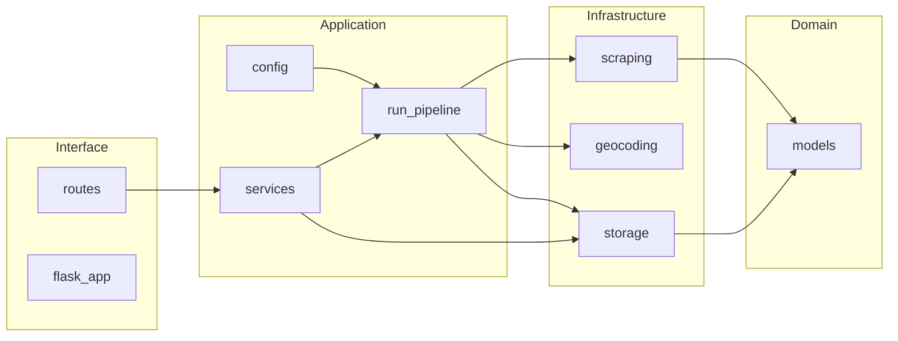

# Fresquito architecture

## Directory tree

```
fresquito/
├── pyproject.toml
├── requirements.txt
├── src/fresquito/
│   ├── domain/           # models.py (WeatherRecord, ExtremeTown)
│   ├── application/      # config.py, run_pipeline.py, services.py
│   ├── infrastructure/   # scraping.py, geocoding.py, storage.py
│   └── interface/       # flask_app.py, api/routes.py
├── interfaz/             # Static UI
├── scripts/             # createcontainer.sh, startcontainer.sh, logs.sh
├── legacy/               # Deprecated scripts (app.py, main.py, newMain.py, etc.)
└── docs/                 # Documentation
```

## Layer roles

- **domain:** Business concepts only (no Flask, no I/O). Defines `WeatherRecord` and `ExtremeTown`.
- **application:** Orchestration and configuration. `run_pipeline()` runs: load index → scrape → merge → extremes → save CSV and map. `services` exposes run_pipeline_town_index, run_pipeline_new_town_index, get_weather_records, get_map_path.
- **infrastructure:** Concrete implementations: El Tiempo API (scraping), Nominatim (geocoding), CSV read/write and Folium map generation (storage).
- **interface:** HTTP only. Flask app and routes that delegate to application services.

## Data flow



## Pipeline (run_pipeline)

1. Load town index CSV (pelmorex_id, name, province).
2. Scrape weather via El Tiempo API (threaded); optional max_locations limit.
3. Merge with index, write merged output to output.csv.
4. Find coldest and hottest rows; append both to datos_tiempo.csv.
5. Geocode coldest and hottest; build Folium map; save map.html and optionally index.nginx-debian.html.

Contract: API routes and JSON/CSV formats are unchanged from the legacy app.
